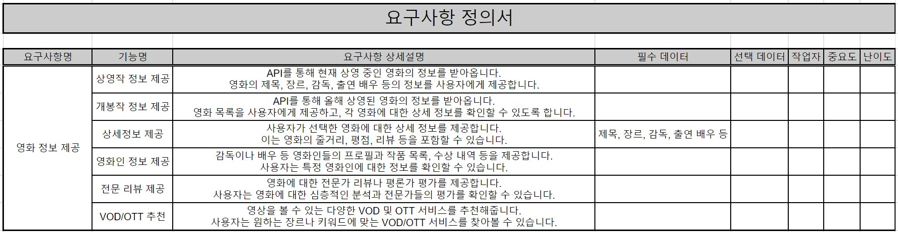
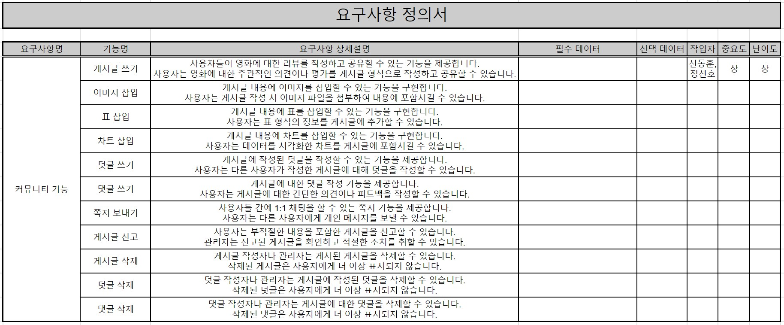
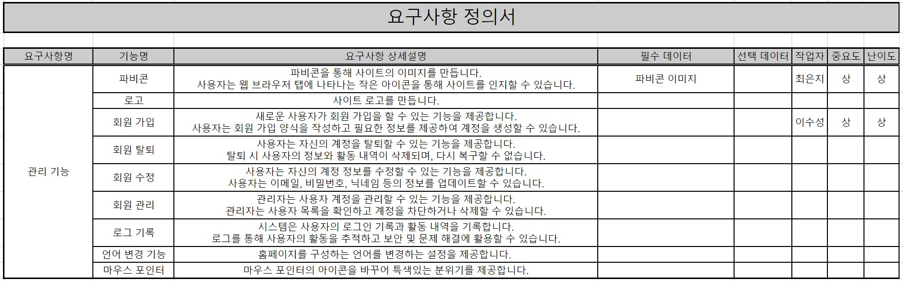
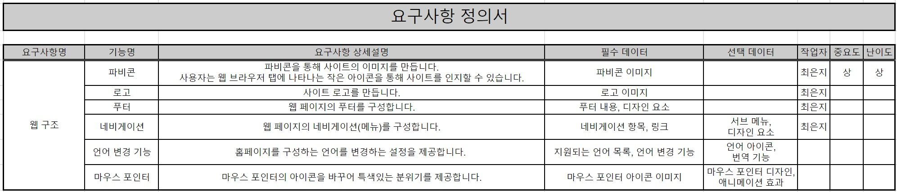

# 📌 VIE: 아 오늘 영화 뭐 보지?

경북산업직업전문학교 "AI를 활용한 빅데이터 플랫폼 개발자과정"의 멀티플랫폼 서비스 개발 프로젝트 저장소입니다. 프로젝트 주제는 "영상 매체 전문 서비스"입니다.  
프로젝트 기간은 2023년 06월 08일부터 2023년 06월 30일입니다.

# 🎺 프로젝트 팀 구성원

|                                      1️⃣ [김신혁](https://github.com/909ma)                                      |                                    2️⃣ [신동훈](https://github.com/Holorifle)                                     |                                     3️⃣ [이수성](https://github.com/goal6722)                                     |                                      4️⃣ [정선호](https://github.com/QQSUNH)                                      |                                    5️⃣ [최은지](https://github.com/EunjiCh0i)                                     |
| :-------------------------------------------------------------------------------------------------------------: | :--------------------------------------------------------------------------------------------------------------: | :--------------------------------------------------------------------------------------------------------------: | :--------------------------------------------------------------------------------------------------------------: | :--------------------------------------------------------------------------------------------------------------: |
| </img> | </img> | </img> | </img> | </img> |

# 📃 프로젝트 개요

이 프로젝트는 영화 관련 커뮤니티 웹 서비스를 개발하는 것을 목표로 합니다. 목표 요구사항에 따라 데이터베이스를 사용하고, UI 기반의 서비스를 구현하며, Java Spring과 Python을 활용하여 공공 데이터를 받아옵니다. 사용자에게 영화 정보를 제공하고, 영화 관련 커뮤니티 기능을 제공합니다.

## ✔️ 목표 요구사항

1. HTML, CSS, Java Script에 익숙해진다.
2. Spring 프레임워크를 익힌다.
3. D3.js를 이용한다.
4. Python을 통해 API 데이터를 받아온다.
5. MySQL를 이용하여 사이트를 관리한다.

## ✅ 프로젝트 기대 효과

1. 이용자들에게 편리한 영화 정보 제공: 프로젝트를 통해 현재 상영 중인 영화와 올해 상영된 영화에 대한 상세 정보를 제공함으로써 이용자들은 편리하게 영화 정보를 확인할 수 있습니다. 이는 영화를 선택하는 데 도움이 되며, 영화에 대한 평가와 리뷰를 통해 이용자들은 영화 선택에 대한 신뢰도를 높일 수 있습니다.

2. 영화 시장 동향에 대한 정보 제공: 국내 영화 산업의 규모가 어느 정도인지, 최근 100일 동안 어떻게 변화했는지에 대한 정보를 차트로 제공함으로써 이용자들에게 합리적인 소비력을 갖추게 합니다.

3. 영화 평점 제공: 영화에 대한 전문가가 평가한 평점을 제공함으로써 사용자들은 참고하여 영화를 선택할 수 있습니다. 이는 영화 선택의 다양성을 늘려줍니다.

4. 이용자들 간의 커뮤니티 형성: 프로젝트를 통해 이용자들은 영화에 대한 리뷰를 작성하고 공유하며, 리뷰에 대한 댓글과 평가를 남길 수 있습니다. 이는 이용자들 간의 소통과 정보 교류를 촉진하며, 영화에 대한 관심을 공유할 수 있는 커뮤니티를 형성할 수 있습니다.

## ☑️ 프로젝트 핵심 가치

1. 의사소통
2. 배려코딩
3. 저작권리 의식
4. 백업 정신

## 📑 프로젝트 진행 및 결과

    
📁 프로젝트 진행 문서

   
## 요구사항 정의서
</img>  
</img> 
</img> 
</img>

## Gantt Chart

</img>

## 프로젝트 일정 관리

</img>

## 웹 구조 다이어그램

</img>

## 테이블 정의서

</img> 
</img>

---

    
📁 프로젝트 결과 자세히 보기

## 데이터베이스 갱신

</img>  
Python으로 만든 DB 관리 툴입니다.
  

## 회원가입 및 로그인

</img>  
회원가입하고 로그인하는 과정입니다.
  

## 네비게이션

</img>  
네비게이션입니다.
  

## BIG 3

</img>  
지금 가장 잘 팔리는 영화 Best 3입니다.
  

## 영화 찾기 및 영화 상세보기

</img>  
데이터베이스에 있는 영화 목록을 보고 영화를 찾아 상세 정보를 확인하는 모습입니다.  
  

## 영화평점

</img>  
주어진 조건과 일치하는 영화들의 평점을 제공합니다.
  

## 상영작 통계

</img>  
상영작 통계를 제공합니다.
  

## 개봉작 통계

</img>  
개봉작 통계를 제공합니다.
  

---

  

## 📝 프로젝트 개선점

1. 프로젝트 시작 전 개발 환경을 통일하지 않았다.
2. 프로젝트 관리를 브런치로 할 지, 파일 대조를 통한 원본 통합 관리로 할 지 미리 정하지 않았다.

## 📚 개발 환경

> OS; Operating System  
>  
>
> >     
> > 

---

> IDE; Integrated Development Environment  
>  
>
> >     
> >     
> > 

---

> Framework  
>  
>
> > 

---

> Database  
>  
>
> > 

---

> Web Browser  
>   
>
> > 

---

> Markup and Styling Languages
>  
>
> >     
> > 

---

> Programming Languages  
>  
>
> >     
> >     
> > 
